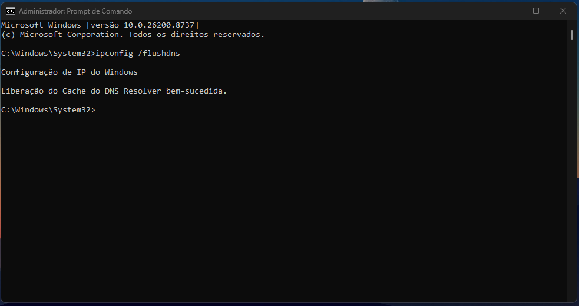
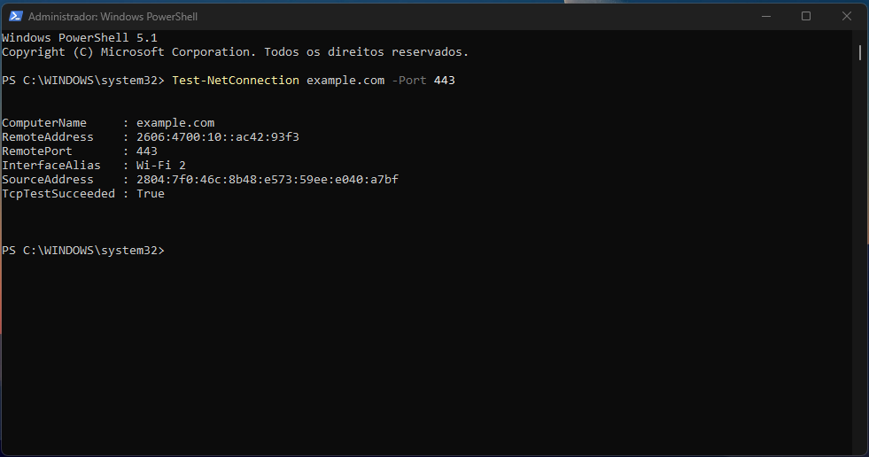
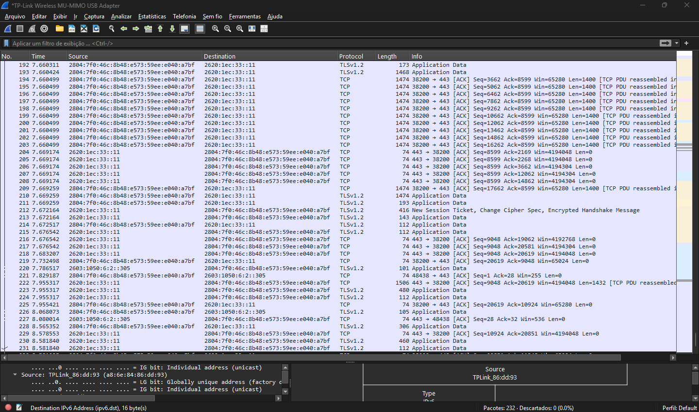
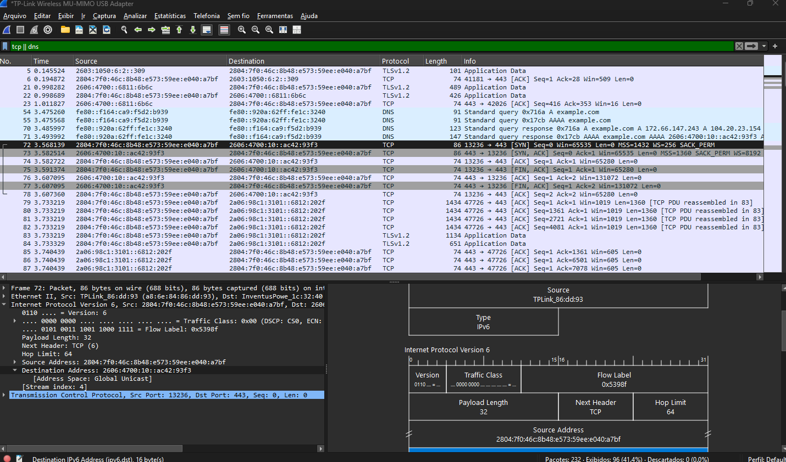
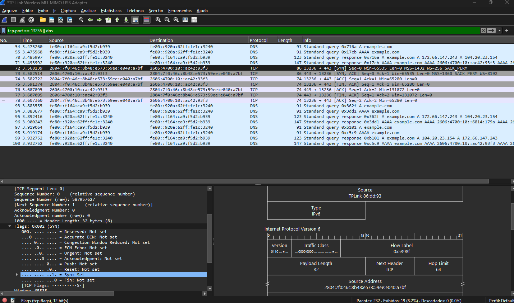

<h1 align="center">TCP Handshake e Resolução DNS</h1>

## Objetivo
Esse laboratório tem como objetivo capturar o acesso ao domínio example.com e analisar como uma conexão TCP é estabelecida, além de observar como a resolução de nomes (DNS) precede o tráfego HTTPS.

## Tecnologias usadas
- Wireshark
- Windows PowerShell
- Prompt de Comando (CMD)

## Preparação do ambiente
Antes de iniciar a captura, limpei o cache DNS com o comando:
```cmd
ipconfig /flushdns
```
Isso garante que o sistema vai fazer uma nova consulta DNS durante o teste, em vez de usar um registro que já tava em cache.



## Captura
Tentei acessar o example.com pelo navegador, mas o handshake não aparecia no Wireshark mesmo com o cache limpo. Pra garantir a captura, usei o comando do PowerShell:
```powershell
Test-NetConnection example.com -Port 443
```
Esse comando resolve o domínio, abre uma conexão TCP na porta 443 pra ver se ela responde, e fecha em seguida. Não abre sessão TLS nem manda requisição HTTP.



O `RemoteAddress` do resultado (`2606:4700:10::ac42:93f3`) é o mesmo IPv6 que apareceu na resposta DNS capturada no Wireshark, e o `SourceAddress` bate com a origem dos pacotes SYN. Isso confirma que o handshake que apareceu na captura era desse comando, e não de outro processo rodando em segundo plano.

Com a captura rodando, executei o comando e foram registrados 232 pacotes, como mostra a barra inferior do Wireshark.



## Troubleshooting
Pra localizar o tráfego de DNS e TCP mais fácil, apliquei o filtro:
```
tcp || dns
```
Isso deixou 96 pacotes visíveis. Nas linhas 70 e 71 tava a resolução DNS pro example.com, e nas linhas 72, 73 e 74 começava o Three-Way Handshake.

Pra ter certeza que era o handshake certo, comparei o IPv6 da resposta DNS com o IP de destino do pacote SYN. Os dois batem:
```
2606:4700:10::ac42:93f3
```

Depois apliquei um filtro mais específico:
```
tcp.port == 13236 || dns
```
13236 é a porta que o sistema escolheu como origem dessa conexão — filtrar por ela isola só os pacotes dessa sessão.

Reparei em algo estranho: depois do ACK final (linha 74), a conexão fechava na hora, com FIN/ACK (linhas 75 a 78), sem nenhum pacote TLS ou dado de aplicação no meio. No começo achei que fosse alguma conexão paralela que o navegador abriu e descartou.

Mas não era isso. O motivo é simples: quem gerou esse tráfego foi o `Test-NetConnection`, e essa ferramenta só testa se a porta responde — ela faz o handshake, confirma que a porta tá aberta e encerra a conexão na hora, sem TLS e sem requisição HTTP. É por isso que não tem Client Hello nem Application Data nessa captura.

Também tinha bastante tráfego TLS indo pro IPv6 `2620:1ec:33::11` na captura completa. Esse tráfego é de outros processos da máquina, sem relação com o teste — a captura pegou a interface inteira, não só o que eu tava testando.



## Análise
Usei de novo o filtro `tcp.port == 13236 || dns` pra focar só nessa sessão.

**Linhas 70 e 71 (DNS):** meu computador manda uma consulta (Standard Query) pro example.com e recebe a resposta (Standard Query Response). Primeiro consulta o registro A (IPv4), depois o AAAA (IPv6). Como minha máquina tem conectividade IPv6 e o domínio tem AAAA válido, a conexão usou o IPv6.

**Linhas 72, 73, 74 (Three-Way Handshake):**
- 72 (SYN): meu PC pede pra abrir conexão na porta 443.
- 73 (SYN, ACK): o servidor confirma que recebeu e também quer conectar.
- 74 (ACK): meu PC confirma, e a conexão é considerada estabelecida a partir daqui.

**Linhas 75 a 78 (encerramento):** logo depois do handshake, rola a troca de FIN/ACK encerrando a sessão. Como foi o `Test-NetConnection` que gerou isso, não teve dado de aplicação trocado — nem todo handshake é seguido de tráfego TLS/HTTP, depende do que a aplicação que abriu a conexão faz depois.



## Conclusão
Esse lab mostrou na prática que o DNS precisa resolver o domínio antes de qualquer conexão TCP começar, e as três etapas do handshake (SYN, SYN/ACK, ACK) até a conexão ficar estabelecida.

O que mais me chamou atenção foi a conexão nunca ter trocado dado nenhum. Fui investigar e descobri que era o próprio `Test-NetConnection` fazendo exatamente o que ele se propõe: testar a porta, não abrir uma sessão de verdade. Foi um lembrete de que entender o que a ferramenta usada realmente faz é tão importante quanto ler os pacotes na tela.

Próximo passo: entender por que o handshake não aparecia direto quando eu tentava pelo navegador, mesmo com o cache DNS limpo.
