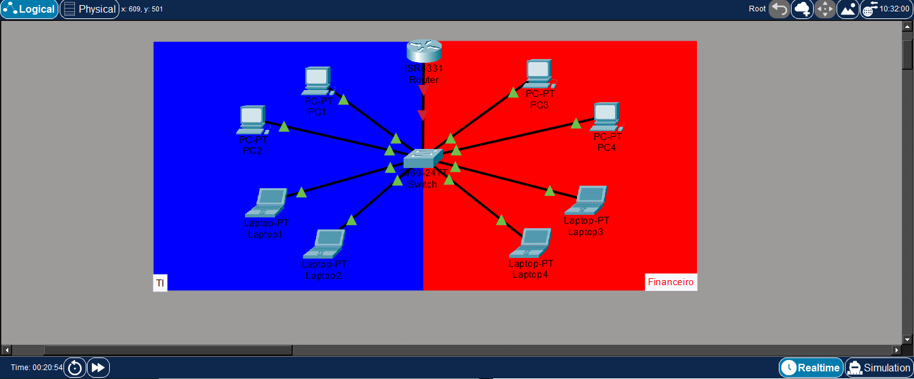
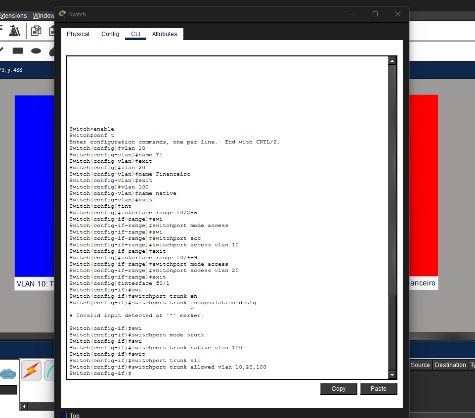
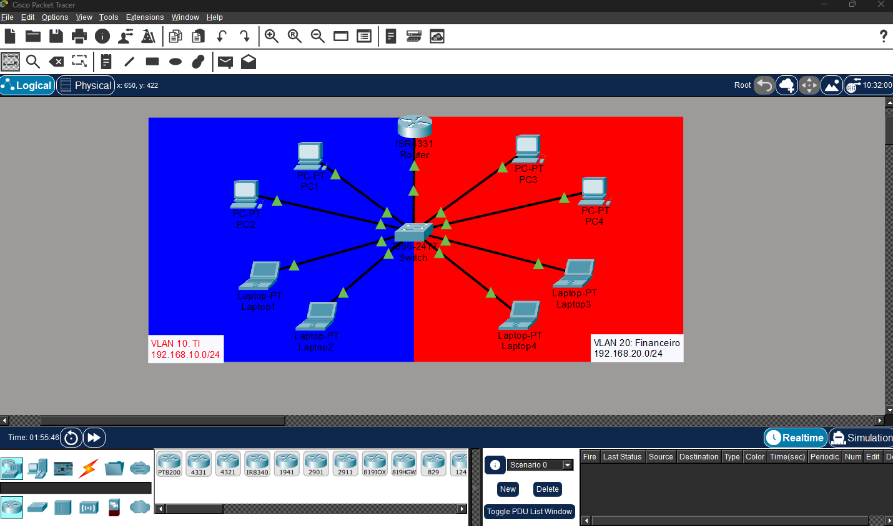

<h1 align="center">Laboratório de Redes - Roteamento Inter-VLAN (Router-on-a-Stick)</h1>

Simulação de segmentação de rede utilizando VLANs e roteamento entre elas por meio da técnica <strong>Router-on-a-Stick</strong>.

---

## Objetivo

Implementar uma rede segmentada em VLANs para separar departamentos distintos e permitir a comunicação entre eles através de um roteador configurado com subinterfaces e encapsulamento IEEE 802.1Q.

---

## Cenário

Imagine uma pequena empresa com dois departamentos:

- **VLAN 10** – TI
- **VLAN 20** – Financeiro

Cada departamento fica em uma rede diferente, então sem configuração nenhuma eles não conseguem se comunicar. Para resolver isso, configurei um roteador com subinterfaces para fazer o roteamento entre as duas VLANs — a técnica conhecida como Router-on-a-Stick.

---

## Tecnologias Utilizadas

- Cisco Packet Tracer
- Cisco IOS
- VLANs
- IEEE 802.1Q
- Router-on-a-Stick
- Inter-VLAN Routing

---

## Topologia

---

## Endereçamento

### VLAN 10 - TI
| Dispositivo | Endereço IP |
|-------------|-------------|
| PC 1 | 192.168.10.11 |
| PC 2 | 192.168.10.12 |
| Notebook 1 | 192.168.10.21 |
| Notebook 2 | 192.168.10.22 |
| Gateway | 192.168.10.1 |

### VLAN 20 - Financeiro
| Dispositivo | Endereço IP |
|-------------|-------------|
| PC 3 | 192.168.20.11 |
| PC 4 | 192.168.20.12 |
| Notebook 3 | 192.168.20.21 |
| Notebook 4 | 192.168.20.22 |
| Gateway | 192.168.20.1 |

---

## Configuração do Switch

Criei as três VLANs no switch, sendo a 100 usada como VLAN nativa:

- VLAN 10 – TI
- VLAN 20 – Financeiro
- VLAN 100 – Native VLAN

Na interface que liga o switch ao roteador, configurei modo trunk com encapsulamento IEEE 802.1Q e defini a VLAN 100 como nativa.

---

## Configuração do Roteador

Configurei três subinterfaces no roteador, uma para cada VLAN, usando encapsulamento IEEE 802.1Q:

- G0/0/0.10
- G0/0/0.20
- G0/0/0.100 (Native VLAN)

Cada subinterface recebeu o IP de gateway correspondente à VLAN, permitindo que o roteador enxergasse as duas redes e fizesse o roteamento entre elas.

---

## Topologia Detalhada

Essa é a topologia final, já com as VLANs, a porta trunk e as subinterfaces do roteador configuradas.

---

## Validação

Testei a conectividade com ping entre dispositivos de VLANs diferentes, pra confirmar que o roteamento Inter-VLAN estava funcionando de verdade e não só configurado no papel. O ping passou entre os dois departamentos, confirmando que o tráfego estava sendo roteado corretamente pelo roteador.

  

---

## Competências Demonstradas

- Criação de VLANs
- Configuração de portas Access
- Configuração de portas Trunk
- VLAN Nativa
- IEEE 802.1Q
- Router-on-a-Stick
- Configuração de Subinterfaces
- Endereçamento IPv4
- Testes de conectividade
- Troubleshooting básico

---

## Aprendizados

Esse foi o primeiro laboratório em que apliquei Router-on-a-Stick na prática, e ficou bem mais claro depois de configurar do que só lendo sobre o assunto. A parte que mais me ajudou a entender o conceito foi ver a diferença entre a porta trunk carregando várias VLANs numa única interface física, e as subinterfaces no roteador separando esse tráfego de volta em redes distintas.

Também ficou mais evidente a importância de manter a VLAN nativa igual dos dois lados (switch e roteador) — um detalhe fácil de esquecer, mas que evita problema de tráfego não identificado passando sem tag pela trunk.

## Autor

**Arthur Fernandes**

Estudante de Ciência da Computação

Focado em Infraestrutura, Redes de Computadores e GNU/Linux.

**LinkedIn:**
[Arthur Fernandes](https://www.linkedin.com/in/arthur-fernandes-289395272)
